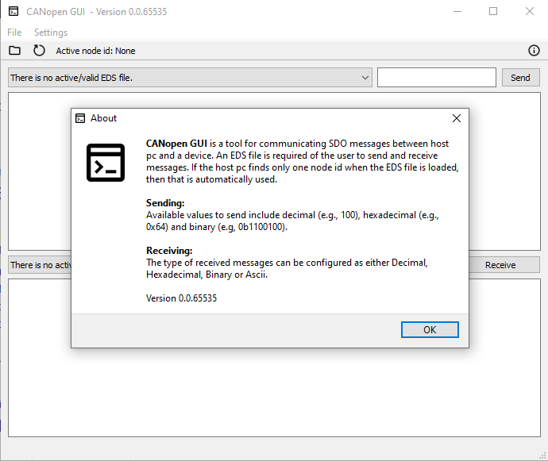

# CANopen GUI

<div align='center'>
    <div>
Used to send and receive SDOs using CANopen protocol. The device on the other end has to support CANopen protocol and a valid EDS file has to be found with available message configurations.

**Supports only PCAN-adapters.**
    </div>
    <br>
    
</div>

# Setup

Packages needed to run the scripts can be installed with
```
pip install -r requirements.txt
```

# How-to's

## Generate executable

Generate executable using **_pyinstaller_** package (available through `pip install pyinstaller`)
```
pyinstaller --onedir --noconsole --name CANopenGUI --icon ./src/icons/icon.ico ./src/gui.py --additional-hooks-dir=./src/hooks --clean --noconfirm
```

- `--onedir` - creates one install directory. Use either this or `--onefile`.
- `--onefile` - create one install file, i.e., executable.
- `--noconsole` - removes the console from the launched executable.
- `--name` - provides name for the executable.
- `--icon` - provides icon for the executable.
- `--additional-hooks-dir` - adds hidden import files, **must** be used.
- `--clean` - removes any build/install files prior.
- `--noconfirm` - forces the removal of build/install files when accompanied by `--clean`.

**Note**: the executable expects the presence of CANopen object "Producer Heartbeat Time", which is hardcoded to 500 kbit/s.

## Generate resources

Resource script `icons.py` is generated with
```
pyside2-rcc src/icons/icons.qrc -o src/icons.py
```
The `pyside2-rcc` resource compiler is installed through the `PySide2` package.  


## Regenerate requirements file
Generate requirements.txt using the **_pipreqs_** package (available through `pip install pipreqs`)
```
pipreqs ./src/ --savepath ./requirements.txt --force
```
`--force` overrides any previous **_requirements.txt_** file while `--savepath` dictates where the result is written to.
